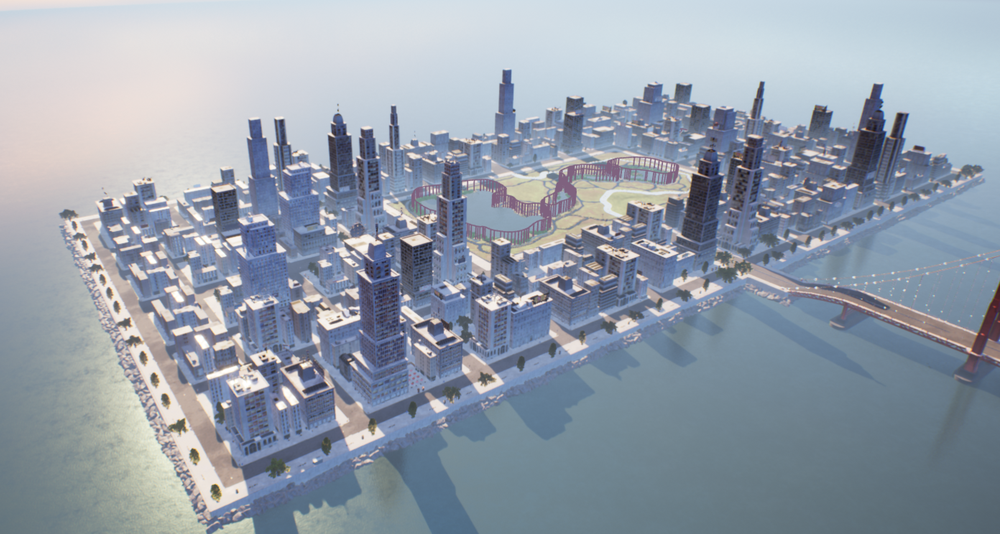
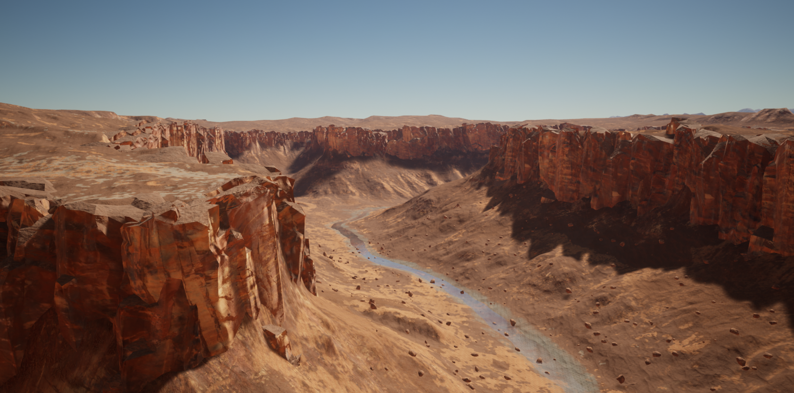

<p align="center">
  <h1 align="center">Monocular Obstacle Avoidance Based on Inverse PPO for Fixed-wing UAVs</h1>
  </p>
  <h3 align="center"><a href="https://arxiv.org/abs/2411.18009">arXiv</a> | <a href="https://youtu.be/DXP54UI2lbE">YouTube</a></h3> 
  <div align="center"></div>

This repository contains the implementation of a lightweight deep reinforcement learning (DRL) based collision avoidance system for fixed-wing unmanned aerial vehicles (UAVs) based on AirSim and JSBSim.

<div style="display: flex; justify-content: space-around; flex-wrap: wrap; max-width: 100%; gap: 0;">             </div>

# :mag_right:Overview

1. [Setup](#nut_and_bolt-setup)
1. [Results](#sparkles-results)
1. [Cite](#scroll-cite)
1. [Acknowledgements](#octocat-acknowledgements)


# :nut_and_bolt: Setup
### Dependency Install

Using [Anaconda](https://www.anaconda.com/download/), you can install dependencies with 

```shell
conda env create -f environment.yml
conda activate MonoPPO
```
### Aircraft Dynamic Model Preparation 

- Move the x8 dir into your JSBSim aircraft dir
- Move the electric800w.xml file into the x8 dir into the engine dir

### Depth Model Preparation

- Download pre-trained relative-depth model provided by [Depth-Anything]([checkpoints/depth_anything_vitl14.pth · LiheYoung/Depth-Anything at main](https://huggingface.co/spaces/LiheYoung/Depth-Anything/blob/main/checkpoints/depth_anything_vitl14.pth)) for initializing the depth encoder and put it under the `checkpoints` directory
- Download pre-trained starnet_s1 model [here](https://github.com/ma-xu/Rewrite-the-Stars/releases/download/checkpoints_v1/starnet_s1.pth.tar) and put it under the `checkpoints` directory

# :sparkles:Results 

<div style="display: flex; justify-content: space-around;">       </div>

<div style="display: flex; justify-content: space-around;">       </div>

<div style="display: flex; justify-content: space-around;">       </div>

# :scroll: Cite

Please cite our work if you find it useful or use any of our code
```latex
@misc{chai2024monocularobstacleavoidancebased,
      title={Monocular Obstacle Avoidance Based on Inverse PPO for Fixed-wing UAVs}, 
      author={Haochen Chai and Meimei Su and Yang Lyu and Zhunga Liu and Chunhui Zhao and Quan Pan},
      year={2024},
      eprint={2411.18009},
      archivePrefix={arXiv},
      primaryClass={cs.RO},
      url={https://arxiv.org/abs/2411.18009}, 
}
```

# :octocat: Acknowledgements
We use part of the code from different repositories. We thank the authors and maintainers of the following repositories.
- [Fixedwing-Airsim](https://github.com/AOS55/Fixedwing-Airsim)
- [Depth-Anything](https://github.com/LiheYoung/Depth-Anything)
- [ZoeDepth](https://github.com/isl-org/ZoeDepth)
- [Rewrite the Stars](https://github.com/ma-xu/Rewrite-the-Stars)
